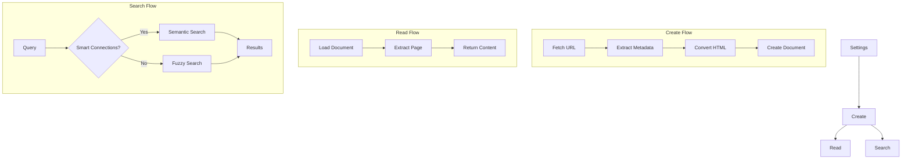

# Source Document Feature

## Overview

The source document feature enables users to create and read web content as paginated Markdown documents in their Obsidian vault. This facilitates thoughtful engagement with online content by breaking it into manageable chunks and integrating it with Obsidian's knowledge management capabilities.

## Implementation Stages

1. Settings
   - Feature toggle
   - Template selection
   - Directory configuration
   - Page size settings

2. Create
   - Fetch web content
   - Extract metadata
   - Convert to Markdown
   - Create vault document

3. Read
   - Access documents
   - Paginate content
   - Preserve block boundaries
   - Track progress

4. Search
   - Semantic search with Smart Connections
   - Fuzzy search fallback
   - Metadata integration
   - Block-level results

## Dependencies

Required:
- Local REST API plugin
- Templater plugin

Optional:
- Smart Connections plugin (enhances search)

## Example Usage

1. Create a source document:
```typescript
const result = await tools.execute("source_create", {
  url: "https://example.com/article",
});
// Result: { documentId: "article-title", metadata: {...} }
```

2. Read a page:
```typescript
const page = await tools.execute("source_read", {
  documentId: "article-title",
  page: 1,
});
// Result: { content: "...", pageNumber: 1, totalPages: 5 }
```

3. Search documents:
```typescript
const results = await tools.execute("source_search", {
  query: "javascript async",
});
// Result: [{ documentId: "...", metadata: {...}, matchingBlock: "..." }]
```

## Implementation Priority

1. Settings Stage
   - Essential for user configuration
   - Required by other stages
   - Minimal dependencies

2. Create Stage
   - Core document creation
   - HTML processing
   - Template integration

3. Read Stage
   - Basic pagination
   - Progress tracking
   - Error handling

4. Search Stage
   - Basic text search
   - Smart Connections integration
   - Result formatting

## Feature Flow



## Implementation Files

```
packages/
├── mcp-server/src/features/source-document/
│   ├── services/
│   │   ├── markdown.ts
│   │   └── document.ts
│   ├── utils/
│   │   ├── sanitize.ts
│   │   └── match.ts
│   ├── constants.ts
│   ├── types.ts
│   └── index.ts
└── obsidian-plugin/src/features/source-document/
    ├── components/
    │   └── Settings.svelte
    ├── services/
    │   └── settings.ts
    ├── constants.ts
    ├── types.ts
    └── index.ts
```

## Error Handling

Each stage implements specific error handling:

1. Settings
   - Invalid configuration
   - Missing dependencies
   - File system issues

2. Create
   - Network failures
   - Invalid HTML
   - Template errors

3. Read
   - Missing documents
   - Invalid pages
   - Content errors

4. Search
   - Plugin availability
   - Query validation
   - Result processing

## Testing Strategy

1. Unit Tests
   - HTML conversion
   - Title sanitization
   - Block extraction
   - Template processing

2. Integration Tests
   - Document creation
   - Page extraction
   - Search functionality

3. End-to-End Tests
   - Complete workflows
   - Error scenarios
   - Edge cases
